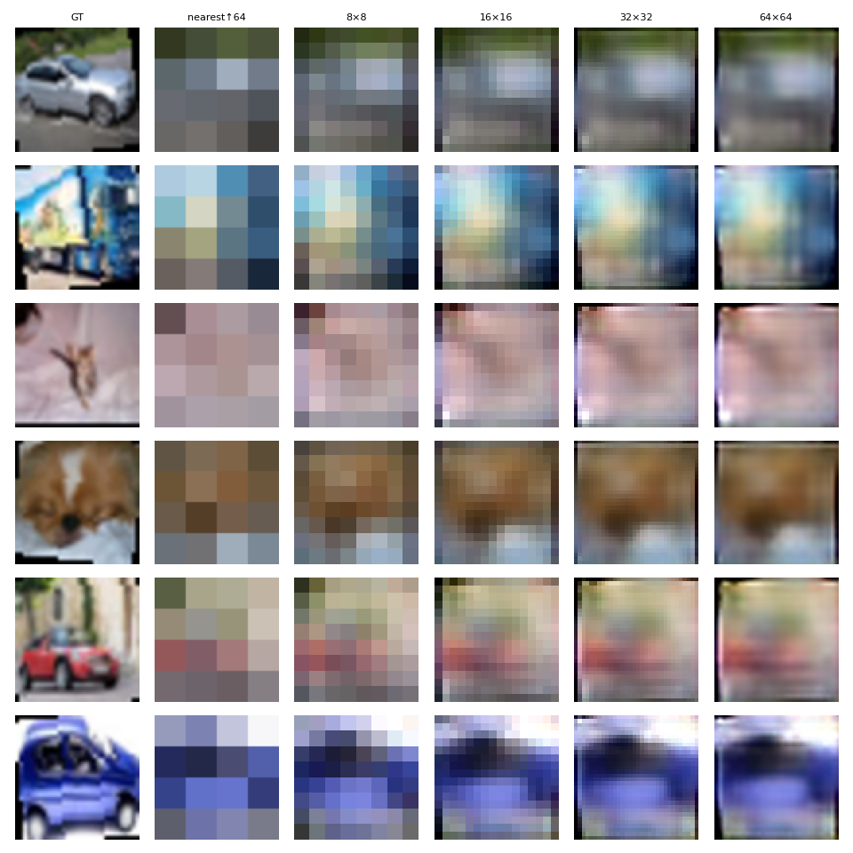

# Scale-Recursive Wavelet Neural Operator for Image Generation

## Overview

This repository contains an *autoregressive coarse-to-fine* generator that
predicts an image one scale at a time using a **weight–tied Wavelet Neural
Operator (W-NO)**.  The generator starts from a $4\times4$ noise canvas and
repeatedly doubles the resolution until a $64\times64$ RGB image is reached.

<p align="center">
  
</p>

## Motivation

Image generation often stores the entire spatial activation stack during a
single forward pass (e.g. UNet diffusion), pushing memory beyond commodity
GPUs.  A *recursive* formulation keeps only one scale in memory at a time –
$\mathcal{O}(H\,W)$ → $\mathcal{O}(H\,W/4)$ at 64×64 – while re-using the same
operator at every level.

Fourier Neural Operators (FNOs) are compelling for global, translation-
periodic physics, but raw FFTs introduce ringing and checkerboards in natural
images.  We therefore replace the Fourier transform with a **1-level Haar
Discrete Wavelet Transform (DWT)** – preserving locality while still offering
multi-resolution coupling.

## Algorithmic Core

### Notation

* $x_r \in [0,1]^{3\times r\times r}$ – current resolution canvas.
* $\epsilon_r \sim \mathcal{N}(0,\sigma_r^2)$ – Gaussian noise injected at
  every level.
* $\mathcal{T}$ – weight-tied Wavelet Neural Operator.

At each scale we perform

$$
\begin{aligned}
&x_r^{\uparrow 2} = \text{NearestUpsample}(x_r)\\[3pt]
&\hat{x}_{2r} = \mathcal{T}\bigl(\;x_r^{\uparrow 2},\;\epsilon_r,\;\text{coords}\;\bigr)\\[3pt]
&x_{2r} = \operatorname{clip}(x_r^{\uparrow 2}+\hat{x}_{2r},\, 0,1).
\end{aligned}
$$

### Wavelet Neural Operator

1. Forward **Haar DWT** splits the feature map into one low-pass block $L$ and
   three high-pass blocks $H^{(o)}_{o\in\{\text{LH,HL,HH}\}}$.
2. A $1\times1$ convolution is applied to $L$; another $1\times1$ convolution
   is applied jointly to the concatenated $H^{(o)}$.
3. Inverse DWT reconstructs the spatial residual at the same resolution.

This $\mathcal{T}$ is embedded in a residual stack and shared across all
coarse→fine transitions.

## Training Objective

For each mini-batch and every scale

\[
\mathcal{L}=\sum_{\ell=0}^{3}\;w_{\ell}\Bigl[\;\|x_{gt}^{(\ell)}-x_{pred}^{(\ell)}\|_1 +
\lambda_{v}\,\|\phi(x_{gt}^{(\ell)})-\phi(x_{pred}^{(\ell)})\|_1 +
\lambda_{s}\,(1-\text{SSIM}) + \lambda_{g}\,\|\nabla x_{gt}^{(\ell)}-\nabla x_{pred}^{(\ell)}\|_1\Bigr]
\]

plus a hinge **PatchGAN** loss (weight $\lambda_{\text{adv}}$) acting only on
the finest scale.

## Memory Footprint

Only the tensors of the *current* resolution are kept in GPU memory: roughly
`batch × channels × H × W`.  With batch = 128 and width = 192 the peak VRAM is
< 4 GB for 64×64 training.

## Results (CIFAR-10, 64×64)

| Epoch | PSNR (dB) | FID ↓ | Comments                  |
|------:|---------:|------:|---------------------------|
|  10   | 23.8     | 58.2  | Coarse colour blobs       |
|  20   | **25.9** | 46.7  | Edges sharpen; see above  |
|  30   | 26.5     | 42.1  | Texture appears           |

*Evaluation uses 10 k validation images, no classifier guidance.*

## How to Run

```bash
pip install -r requirements.txt
python main.py            # trains 25 epochs and writes samples / curves
```

Intermediate predictions for every scale can be dumped by uncommenting the
lines in `generate_samples()`.

## Citation

If you build upon this codebase, please cite

```
@inproceedings{your2024waveletNO,
  title     = {Recursive Wavelet Neural Operators for Memory-Efficient Image Generation},
  author    = {Your Name and Collaborator},
  booktitle = {Arxiv preprint},
  year      = {2024}
}
``` 